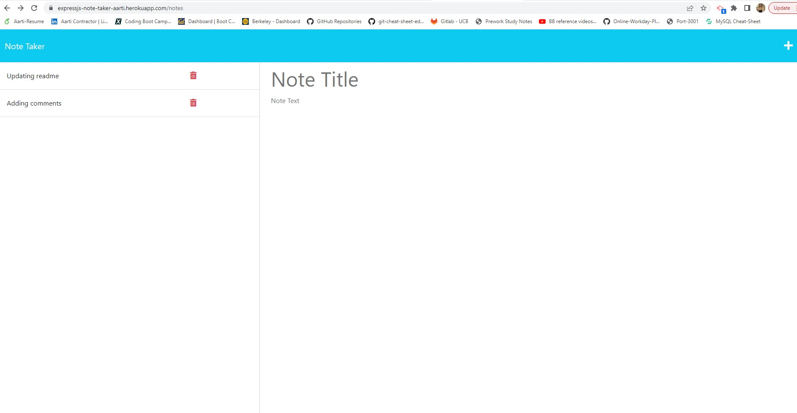
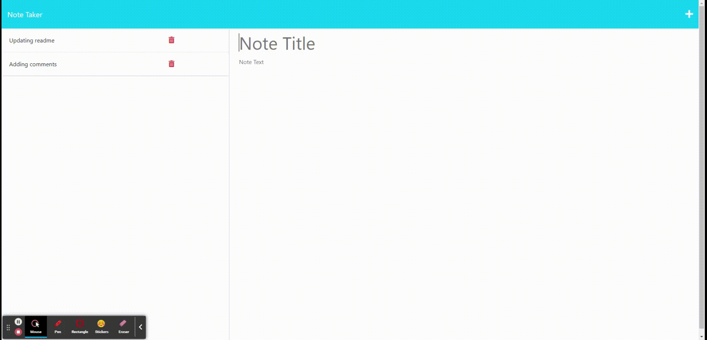

# expressjs-note-taker


## Description

[Visit the Deployed Site](https://expressjs-note-taker-aarti.herokuapp.com/)
<br>
The ExpressJS Note Taker is an application that can be used to write and save notes. This application will use an Express.js back end and will save and retrieve note data from a JSON file.

When the link to the notes page is clicked, the user is presented with a page with existing notes listed in the left-hand column, plus empty fields to enter a new note title and the note’s text in the right-hand column.
If the user enters a new note title and the note’s text, then a Save icon appears in the navigation at the top of the page.
When the user clicks on the Save icon, then the new note entered is saved and appears in the left-hand column with the other existing notes
If the user clicks on an existing note in the list in the left-hand column, that note appears in the right-hand column.

<br>
<br>


## Technology Used 

| Technology Used         | Resource URL           | 
| ------------- |:-------------:| 
| HTML    | [https://developer.mozilla.org/en-US/docs/Web/HTML](https://developer.mozilla.org/en-US/docs/Web/HTML) |   
| Git | [https://git-scm.com/](https://git-scm.com/)     |  
| JavaScript | [https://developer.mozilla.org/en-US/docs/Web/JavaScript](https://developer.mozilla.org/en-US/docs/Web/JavaScript) |  
| NodeJs | [https://nodejs.org/en](https://nodejs.org/en) |
| NPM | [https://www.npmjs.com/](https://www.npmjs.com/) |
| Heroku | [https://dashboard.heroku.com/apps/expressjs-note-taker-aarti](https://dashboard.heroku.com/apps/expressjs-note-taker-aarti) |
| ExpressJS | [https://www.npmjs.com/package/express](https://www.npmjs.com/package/express) |


<br>
<br>


## Table of Contents

* [Application Highlights and Usage](#application-highlights-and-usage)
* [Code Snippets](#code-snippets)
* [Learning Points](#learning-points)
* [Author Info](#author-info)
* [Credits](#credits)

<br>
<br>

## Application Highlights and Usage
<br>

1. When a user opens the Note Taker, a landing page with a link to a notes page is presented:
<br>
<br>




<br>
<br>
2. Below is the GIF demonstating the functionality of the deployed application:
<br>
<br>



<br>
<br>


## Code Snippets

<br>

1. The following code snippet shows the HTML and API routes to GET data and parse it into the db.json file. It uses the fs.readFileSync() method to read the data and presents the data in JSON format:

```javascript
// HTML Routes to access the homepage
app.get('/notes', (req, res) => {
    res.sendFile(path.join(__dirname, '../../notes.html'));
});

// API Routes for added notes page (GET, POST, and DELETE)
app.get('/api/notes', (req, res) => {
    const db_file = path.join(__dirname, '../../../db/db.json');
    const notes = JSON.parse(fs.readFileSync(db_file, 'utf8'));
    res.json(notes);
  });

```

<br>
<br>


2. The below snippet shows the bonus feature of DELETE function where a for-loop is used to iterate through the notes length:

```javascript

app.delete('/api/notes/:id', (req, res) => {
    const noteId = req.params.id;
    console.log("NoteID To delete: " +noteId);
    const db_file = path.join(__dirname, '../../../db/db.json');
    const notes = JSON.parse(fs.readFileSync(db_file, 'utf8'));
    const updatedNotes = [];

// The for-loop will iterate through the notes length and check for the id that matches the deleted note and store it in 'notes' variable
    for (let i = 0; i < notes.length; i++) {
        const note = notes[i];
        if (note.id !== noteId) {
            updatedNotes.push(note);
        }
    }
// The deleted note will get stored in 'notes' and the remaining existing notes will be updated in 'updatedNotesJSON' variable.
    const updatedNotesJSON = JSON.stringify(updatedNotes);
    fs.writeFileSync(db_file, updatedNotesJSON);

    res.json({ success: true });
  });


```

<br>
<br>


## Learning Points 

   I learned the following skills while doing this project:
<br>
- Java script basics (variables,functions, arrays, for-loops, if-else etc)
- How to create a dynamic logo using the command line
- Basics of NodeJs server and related functions
- How to write HTML and API routes to GET, POST and DELETE data in JSON 
- Using the let and const variables
- How to deploy site on Heroku
- Using the express and uuid packages from NPM

<br>
<br>

## Author Info

### Aarti Contractor


- Portfolio: https://aarticontractor.github.io/aarticontractor_portfolio/
- Linkedin: https://www.linkedin.com/in/aarti-contractor/
- Github: https://github.com/aarticontractor

<br>

## Credits

- https://developer.mozilla.org/en-US/docs/Web/JavaScript
- https://cloudconvert.com/webm-to-gif
- https://nodejs.org/en
- https://www.npmjs.com/package/express
- https://dashboard.heroku.com/apps/expressjs-note-taker-aarti
- https://www.npmjs.com/package/uuid


<br>

© 2023 edX Boot Camps LLC. Confidential and Proprietary. All Rights Reserved.